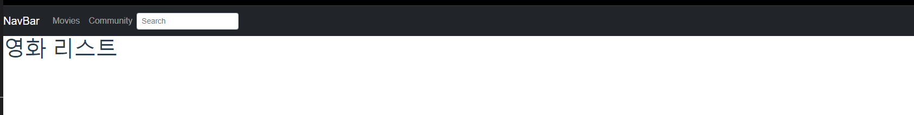
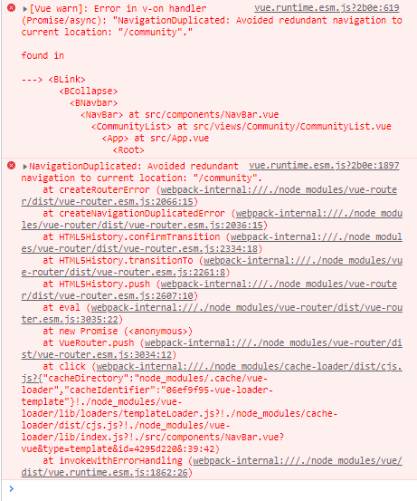

# 일지


## 11월 18일

- [x] vue 프로젝트 구성(router, vuex 추가 // bootstrap, axios, lodash 설치) 
- [x] App component 
  - [x] Movies router-view 
  - [x] Community router-view  
  - [x] Login router-view 
- [ ] MovieList component 
- [ ] MovieListItem component 
- [x] CommunityMenu component 
- [x] CommunityAll component 
- [x] CommunityFree component 
- [x] CommunityRecommned comonent 
- [ ] 백앤드 연동 흐름 미리 구성(text 시 주석 처리) 
- [ ] 영화 목록 조회 구현(api 데이터로) 


### App component & router-view

- Index vue

  - App.vue가 최상위 컴포넌트로서 `<router-view/>`가 있어야 했기 때문에 첫 사이트 입장 시 사용자가 원하는 공간으로 바로 이동할 수 있는 index 페이지를 컴포넌트로 따로 구성해주었다.
  - **index 컴포넌트**는 **<menu-list/>** 컴포넌트를 하위 컴포넌트로 지닌다.

  ```vue
  <template>
    <div id="home" class="d-flex flex-column justify-content-center align-items-center">
      
      <menu-list></menu-list>
    </div>
  </template>
  
  <script>
  import MenuList from '@/components/MenuList'
  
  export default {
    name: 'Index',
    components: {
      MenuList
    }
  }
  </script>
  
  <style scoped>
  #home{
    /* 부모 요소의 높이가 정해져있어야 d-flex를 이용한 정가운데 정렬 가능 */
    height: 50vh;
  }
  
  </style>
  ```


### NavBar 컴포넌트

- bootstrap-vue 의 navbar 컴포넌트 코드를 가져왔다.

  [Navbar | Components | BootstrapVue](https://bootstrap-vue.org/docs/components/navbar#navbar)

- search 버튼이 내 마음대로 배치가 안되었기 때문에 그냥 지워버렸다.

- NavBar 컴포넌트는 movies 와 community 컴포넌트의 공통 자식 컴포넌트로 들어간다.





### $router.push 와 event 에러 디버깅(NavBar 에러)

- NavBar에서 클릭 시 현재 경로와 동일한 경로로 이동하는 component를 누를 경우, 다음과 같은 콘솔 에러 발생('/community/에 있는데 community 탭을 누른 경우)

  

  - 에러가 난 부분의 코드는 다음과 같다.

    ```vue
    <b-nav-item @click="$router.push('/community')">Community</b-nav-item>
    ```

    현재 있는 주소와 동일한 주소로 $router.push를 하면 발생하는 에러라고 한다.

    해결방법은

    1. catch()로 오류를 잡아내서 push 동작을 실행하지 않게 하기
    2. if 조건문으로 현재 경로에 있지 않을 때 push() 실행하기
    3. router-link로 바꾸기

    가 있다.  나는 logo부분과 Movies는 router-link로 바꿔보았고, community 부분은 catch를 걸어주었다.

    

    에러는 해결 되었으나 router-link로 바꿔 준 부분이 디저인, 코드 모든 측면에서 별로였다. 그냥 모두 catch를 걸어주기로 했다.

    **수정 후**

    ```vue
    <b-nav-item @click="$router.push('/community').catch(()=>{})">Community</b-nav-item>
    ```

    참고: https://blog.nachal.com/1507


### Nested Router(중첩 라우터)

- 최상위 App.vue 컴포넌트에 router-view가 있고, 그 하위 컴포넌트에 또 router-view가 있을 때

- 기본적으로 router로 경로가 연결되어 있는 컴포넌트들은 최상위 컴포넌트의 router-view에 랜더링이 된다.

- 그런데 하위 컴포넌트 A 안에 또 랜더링할 컴포넌트 B가 있는 경우

  - A 컴포넌트와 맵핑한 url 경로의 자식 url과 컴포넌트를 router 폴더의 index에서 children 속성으로 A 컴포넌트의 router-view에 렌더링할 컴포넌트를 맵핑한다.

  ```vue
  {
      path: '/community',
      name: 'Community',
      component: CommunityList,
      children: [
        {
          path: '/community/all-community',
          name: 'AllCommunity',
          component: AllCommunity,
        },
  
        {
          path: '/community/free-community',
          name: 'FreeCommunity',
          component: FreeCommunity
        },
  
        {
          path: '/community/recommend-community',
          name: 'RecommendCommunity',
          component: RecommendCommunity
        },
  
      ]
    },
  ```

  참고: https://router.vuejs.org/kr/guide/essentials/nested-routes.html

  

### b-table에서 각 column에 style 속성을 적용하는 방법

- bootstrap-vue에서 제공하는 b-table은 각각의 column에 접근할 방법이 마땅치 않다.

- 여러 방법들 중 가장 나에게 맞는 방법은 아래와 같았다.

  ```vue
  <b-table fixed bordered hover :items="items" :fields="fields">
          <template #table-colgroup="scope">
            <col
              v-for="field in scope.fields"
              :key="field.key"
              :class="[{category : field.key === '분류'}, {title : field.key === '제목'}]"
              >
          </template>
  </b-table>
  
  <style>
  .category{
    text-align: center;
    width: 5%;
  }
  
  .title{
    width: 60%;
  }
  </style>
  ```

  클래스 객체 바인딩으로 column 필드명에 따라 스타일을 개별적으로 적용해줄 수 있었다. 얼른 생각이 나지 않아서 찾느라 애를 좀 먹었다.

  참고

  - https://bootstrap-vue.org/docs/components/table#tables (table colgroup 항목 참조)


## 11월 19일

