# 최종 프로젝트 README(Front-end)


## 11월 18일

- [x] vue 프로젝트 구성(router, vuex 추가 // bootstrap, axios, lodash 설치) 
- [x] App component 
  - [x] Movies router-view 
  - [x] Community router-view  
  - [x] Login router-view 
- [x] MovieList component 
- [x] MovieListItem component 
- [x] CommunityMenu component 
- [x] CommunityAll component 
- [x] CommunityFree component 
- [x] CommunityRecommned comonent 
- [x] 백앤드 연동 흐름 미리 구성(text 시 주석 처리) 
- [x] 영화 목록 조회 구현(api 데이터로) 


### App component & router-view

- Index vue

  - App.vue가 최상위 컴포넌트로서 `<router-view/>`가 있어야 했기 때문에 첫 사이트 입장 시 사용자가 원하는 공간으로 바로 이동할 수 있는 index 페이지를 컴포넌트로 따로 구성해주었다.
  - **index 컴포넌트**는 **<menu-list/>** 컴포넌트를 하위 컴포넌트로 지닌다.

  ```vue
  <template>
    <div id="home" class="d-flex flex-column justify-content-center align-items-center">
      
      <menu-list></menu-list>
    </div>
  </template>
  
  <script>
  import MenuList from '@/components/MenuList'
  
  export default {
    name: 'Index',
    components: {
      MenuList
    }
  }
  </script>
  
  <style scoped>
  #home{
    /* 부모 요소의 높이가 정해져있어야 d-flex를 이용한 정가운데 정렬 가능 */
    height: 50vh;
  }
  
  </style>
  ```


### NavBar 컴포넌트

- bootstrap-vue 의 navbar 컴포넌트 코드를 가져왔다.

  [Navbar | Components | BootstrapVue](https://bootstrap-vue.org/docs/components/navbar#navbar)

- search 버튼이 내 마음대로 배치가 안되었기 때문에 그냥 지워버렸다.

- NavBar 컴포넌트는 movies 와 community 컴포넌트의 공통 자식 컴포넌트로 들어간다.


### $router.push 와 event 에러 디버깅(NavBar 에러)

- NavBar에서 클릭 시 현재 경로와 동일한 경로로 이동하는 component를 누를 경우, 다음과 같은 콘솔 에러 발생('/community/에 있는데 community 탭을 누른 경우)

  

  - 에러가 난 부분의 코드는 다음과 같다.

    ```vue
    <b-nav-item @click="$router.push('/community')">Community</b-nav-item>
    ```

    현재 있는 주소와 동일한 주소로 $router.push를 하면 발생하는 에러라고 한다.

    해결방법은

    1. catch()로 오류를 잡아내서 push 동작을 실행하지 않게 하기
    2. if 조건문으로 현재 경로에 있지 않을 때 push() 실행하기
    3. router-link로 바꾸기

    가 있다.  나는 logo부분과 Movies는 router-link로 바꿔보았고, community 부분은 catch를 걸어주었다.

    

    에러는 해결 되었으나 router-link로 바꿔 준 부분이 디저인, 코드 모든 측면에서 별로였다. 그냥 모두 catch를 걸어주기로 했다.

    **수정 후**

    ```vue
    <b-nav-item @click="$router.push('/community').catch(()=>{})">Community</b-nav-item>
    ```

    참고: https://blog.nachal.com/1507


### Nested Router(중첩 라우터)

- 최상위 App.vue 컴포넌트에 router-view가 있고, 그 하위 컴포넌트에 또 router-view가 있을 때

- 기본적으로 router로 경로가 연결되어 있는 컴포넌트들은 최상위 컴포넌트의 router-view에 랜더링이 된다.

- 그런데 하위 컴포넌트 A 안에 또 랜더링할 컴포넌트 B가 있는 경우

  - A 컴포넌트와 맵핑한 url 경로의 자식 url과 컴포넌트를 router 폴더의 index에서 children 속성으로 A 컴포넌트의 router-view에 렌더링할 컴포넌트를 맵핑한다.

  ```vue
  {
      path: '/community',
      name: 'Community',
      component: CommunityList,
      children: [
        {
          path: '/community/all-community',
          name: 'AllCommunity',
          component: AllCommunity,
        },
  
        {
          path: '/community/free-community',
          name: 'FreeCommunity',
          component: FreeCommunity
        },
  
        {
          path: '/community/recommend-community',
          name: 'RecommendCommunity',
          component: RecommendCommunity
        },
  
      ]
    },
  ```

  참고: https://router.vuejs.org/kr/guide/essentials/nested-routes.html

  

### b-table에서 각 column에 style 속성을 적용하는 방법

- bootstrap-vue에서 제공하는 b-table은 각각의 column에 접근할 방법이 마땅치 않다.

- 여러 방법들 중 가장 나에게 맞는 방법은 아래와 같았다.

  ```vue
  <b-table fixed bordered hover :items="items" :fields="fields">
          <template #table-colgroup="scope">
            <col
              v-for="field in scope.fields"
              :key="field.key"
              :class="[{category : field.key === '분류'}, {title : field.key === '제목'}]"
              >
          </template>
  </b-table>
  
  <style>
  .category{
    text-align: center;
    width: 5%;
  }
  
  .title{
    width: 60%;
  }
  </style>
  ```

  클래스 객체 바인딩으로 column 필드명에 따라 스타일을 개별적으로 적용해줄 수 있었다. 얼른 생각이 나지 않아서 찾느라 애를 좀 먹었다.

  참고

  - https://bootstrap-vue.org/docs/components/table#tables (table colgroup 항목 참조)


## 11월 19일

- [x] CommunityArticles component
- [x] CommunityArticle component
- [x] Article Comments
- [x] CommunityCreate component
- [x] CommunityUpdate component
- [x] Login modal
- [x] signup component
- [x] profile component
- [x] MovieList component
- [x] MovieListItem component
- [x] 백앤드 연동 흐름 미리 구성(test 시 주석 처리)
- [x] component 폴더 정리

### b-table row 클릭 시 상세 글 조회 페이지로 넘어가기

- bootsrtapvue 의 컴포넌트인 b-table은 record 부분을 내가 직접 제어할 수가 없다.
- 대신 하위 컴포넌트인 row 레코드에서 클릭 이벤트를 상위 컴포넌트인 b-table로 올라오기 때문에 아래와 같이 지정해줄 수 있다!(row-clicked 이벤트)
- 또한 안에 테이블 row를 갖다댈 때 tbody 태그 커서를 포인터로 변경되게끔 스타일 지정을 해줬다.

```
<b-table id="my-table" fixed bordered hover 
        :items="items" 
        :fields="fields"
        :per-page="perPage"
        :current-page="currentPage"
        @row-clicked="rowClicked"
      >
        <template #table-colgroup="scope">
          <col
            v-for="field in scope.fields"
            :key="field.key"
            :class="[{category : field.key === '분류'}, {title : field.key === '제목'}]"
            >
        </template>
      </b-table>
```

참고: https://lowell-dev.tistory.com/74

### 게시글 상세 페이지와 댓글 목록

- 게시글의 id를 동적 라우팅 매칭으로 받아서 해당 id로 상세 글 페이지의 내용물을 출력할 수 있게 구성했다.
- 댓글 목록 또한 게시글의 id로 API get요청을 하여 받아올 예정!

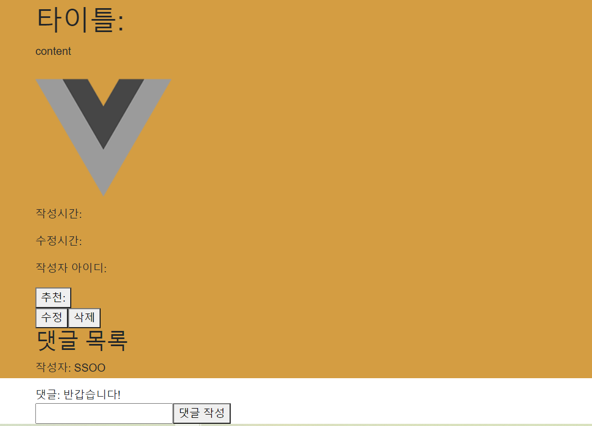

### 위 화면에서 배경색 잘림 방지

- 이거 때문에 골머리를 썩었다.
- 원인은 댓글 container부분이 최상위 컴포넌트 app의 높이 범위를 벗어난 것!
- app에 overflow속성을 auto로 지정해주면 해결된다.(html, body 태그에 너비, 높이 설정을 100%로 해줘야 app 컴포넌트 너비, 높이를 100%으로 해줬을 때 스타일이 적용된다.)

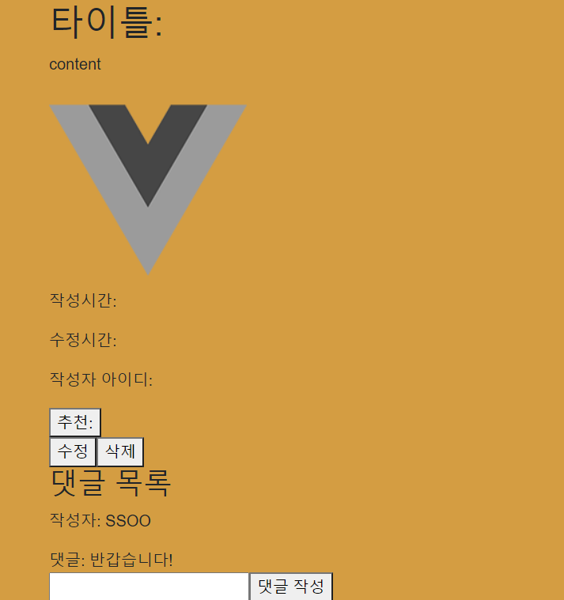


### 로그인 모달 화면

- 모달을 직접 구현하려니, 시간도 없고 조바심이 나서 잘 안되는 것 같았다.
- 구현하는 데 너무 오래 걸려서 그냥 라이브러리 설치했다.(vue-js-modal 라이브러리)
- 다음에 여유 있을 때 직접 구현해봐야겠다.

[Usage | Vue.js Modal](https://euvl.github.io/vue-js-modal/Usage.html#configuration)

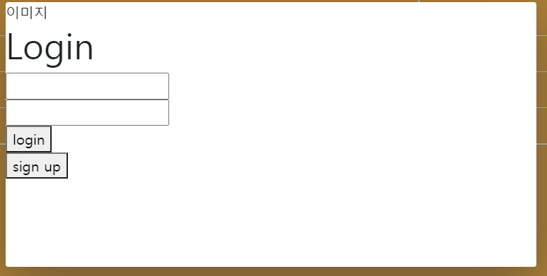

- 기본적으로 사용방법이 크게 어렵진 않았다.
- static 모달로 사용하는 방법도 있었지만, 로그인 모달 컴포넌트를 만들어서 동적으로 모달을 구현했다.

```
<template>
  <div>
     <aside>이미지</aside>
      <section class="d-flex flex-column">
        <h1>Login</h1>
        <!-- 부트스트랩 login form 사용 예정 -->
        <form @submit="toLogin">
          <input type="text">
          <br>
          <input type="text">
          <br>
          <button>login</button>
        </form>
        <form @submit="toSignUp">
          <button>sign up</button>
        </form>
      </section>
  </div>
</template>

<script>

export default {
  name: 'LoginModal',
  data(){
    return{
      username: null,
      password: null,
    }
  },

  methods:{
    toLogin(event){
      event.preventDefault()
      const payload = {
        username : this.username,
        password : this.password
      }
      this.$emit('close')
      this.$store.dispatch('', payload)
    },
    
    toSignUp(event){
      event.preventDefault()
      this.$emit('close')
      this.$router.push({name: 'SignUp'}).catch(()=>{})
    }
  }
}
</script>

<style>

</style>
```

### public의 index html

- 알고보니 최상위 컴포넌트 app에서 더 상위가 있었는데 이게 public의 index html이었다.
- 여기서 html이나 body의 스타일 지정을 해주거나 상속되는 스타일 속성 지정이 가능했다.

### 게시판 글 작성 시 현재 들어간 게시판에 따른 분류 고정

- 자유 게시판에서 글 작성 버튼을 누르면 자유, 추천 게시판에서 글 작성 버튼을 누르면 추천으로 카테고리를 default 지정해주는 방법
- 동적 라우팅 매칭으로 자유 게시판은 url 주소에 free, 추천 게시판은 recommend가 붙어 있어서 이를 글 작성 컴포넌트의 selected 속성 바인딩을 하여 고정 완료

ex)

- 자유게시판 컴포넌트

```
<template>
  <div>
    <create-article :category="category"></create-article>
    <community-articles></community-articles>
  </div>

</template>

<script>
import CommunityArticles from  '@/components/community/CommunityArticles'
import CreateArticle from '@/components/community/CreateArticle'

export default {
  name: 'FreeCommunity',
  components: {
    CommunityArticles,
    CreateArticle
  },
   data(){
    return{
      category: 'free'
    }
  }
}
</script>

<style>

</style>
```

- 글 작성 버튼 컴포넌트

```
<template>
  <button @click="communityCreate"> 글 작성하기 </button>
</template>

<script>
export default {
  name: 'CreateArticle',
  props:{
    category: {
      type: String
    }
  },

  methods:{
    communityCreate(){
      this.$router.push({name: 'CommunityCreate', params: {category : this.category || 'all'}}).catch(()=>{})
    }
  }
}
</script>

<style>

</style>
```

- 기본적으로 글 작성 버튼도 컴포넌트이기 때문에 상위 컴포넌트에서 props로 데이터 전달이 가능했다.
- 자유게시판 컴포넌트는 data로 자신의 카테고리 free를 가지고 있고, 이를 하위 컴포넌트(글 작성 버튼)에게 전달하면, 하위 컴포넌트는 사용자가 자신의 버튼을 눌렀을 때 상위 컴포넌트에서 전달받은 카테고리에 따라 라우팅 push동작을 실행한다.


## 11월 20일

### router 네비게이션 가드

- 로그인한 유저, 로그인하지 않은 유저에 따라 화면 구성이 조금 달라지고, 권한에 따라 컨텐츠 이용이 제한된다.
- 로그인을 했으면 ⇒ 로그인 버튼이 없어지고 로그아웃 버튼이 생긴다. 또한 배너를 클릭 시 index 페이지가 아닌 영화 목록 페이지로 이동한다.
- 로그인을 안 했으면 ⇒ 로그인 버튼이 있고, 리뷰 댓글 게시글 작성이 제한된다.
- 권한이 없는 사용자가 글 작성 버튼을 누를 시 아래와 같이 모달창이 나온다.

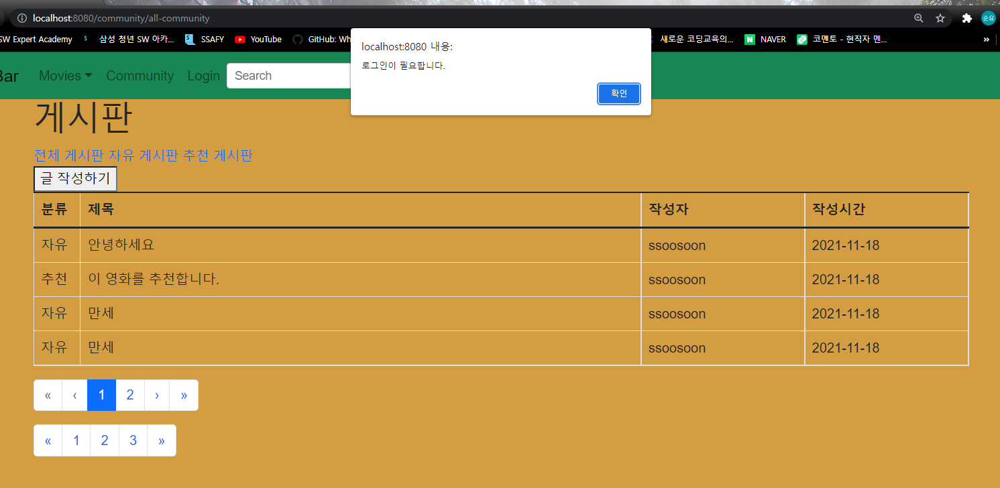

- 네비게이션 가드 동작 중에 next로 현재 url 페이지로 리다릭트 하도록 구성을 했다가 Uncaught 에러가 console창에 살벌하게 찍혔다.
  - 같은 주소로 next 보내서 그런가 싶어 이리저리 시도한 끝에
  - 코드 어딘가에 router.push 동작 중 catch()를 해주지 않은 부분이 있어서 생긴 문제였다는 걸 뒤늦게 발견했다.
  - 해당 에러는 vue-router 가 업그레이드 되면서 console창에 찍어주는 에러라고 한다.
  - 에러의 근본 원인은 vue-router 디자인 문제에서 기인한 것이었다.
    - 내가 A페이지 컴포넌트에서 B 페이지로 router.push()하기로 하면서
    - 네비게이션 가드로 B페이지에서 C페이지로 이동하게끔 설정해뒀다면
    - A페이지에서 B페이지로 가기로 했던 라우터 동작이 채 실행되기도 전에 C페이지로 이동해버리면서 B페이지는 렌더링이 되지 않는다.
    - 그래서 vue-router는 A페이지에서 B페이지로 가는 버튼을 눌렀을 때, '당신은 A페이지에서 B페이지로 가기로 했지만, 네비게이션 가드로 인해 (C 페이지로) 이동되었습니다.' 하고 친절하게 알려주는 것이다.(생김새는 무섭지만 친절한 아이였다.)
  - 나 같은 경우는 본래 글 작성을 눌렀을 때 글 작성 페이지로 이동되어야 하는 것을 네비게이션 가드로 막았기 때문에 발생했던 것
  - 내가 참고한 문서에서는 되도록이면 페이지 이동 시 router-link를 쓰거나, push()를 쓸 경우에는 catch()를 거는 방법을 권하고 있다.  그래서 push()하는 곳 전부에 catch()를 걸어줬더니 에러가 해결되었다.
  - 뒤늦게 안 사실인데 catch()가 되는 이유는 router.push()의 반환형이 promise 객체였기 때문...(그래서 비동기적으로 동작했던 것이었다.)
  - 하단에 Uncaught in promise 문구만 봐도, 어딘가에 promise 요청이 실패해서 실패 메시지를 들고 왔는데 잡아주는 곳이 없어서 자기 좀 잡아 달라고 소리 지르고 있는 것 같다.

```
Uncaught (in promise) Error: Redirected from "{url A}" to "{url C}" via a navigation guard.
```

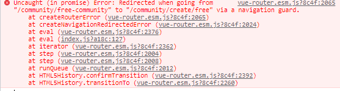

참고: https://vuejscode.com/vue-router-—-uncaught-in-promise-error-redirected-from-login-to-via-a-navigation-guard

여담이지만 나와 비슷한 문제를 겪고 있는 사람들이 엄청나게 많다는 걸 구글링하면서 알았다. 어느 글에서는 질문에 대한 답변 중에 '자기도 같은 오류를 겪고 있는데 도저히 해결 방법을 모르겠다.'는 답변이 내 마음을 아프게 했다.


## 11월 21일

## axios base url 설정하기

- 수업 시간 때 잠시 다루었던 방법
- store/index.js 상단에 `import axios from 'axios'` 를 하고 다음과 같이 선언(Vue.use(Vuex 아래))

```
axios.defaults.baseURL = process.env.VUE_APP_BACK_END_URL
```

- `process.env.VUE_APP_BACK_END_URL`
  - 따로 구성한 환경변수
  - 해당 환경변수에 API 기본 주소가 들어가 있다.
  - 파일의 위치는 프로젝트 폴더 바로 아래!


```
VUE_APP_BACK_END_URL=http://127.0.0.1:8000/
```


### 새로 고침 시 vuex state 초기화 이슈

- 정말 세상 짜증나는 이슈
- 아직 vuex와 SPA에 익숙하지 않아서 그런지, 상태관리에 매우 미숙하다.
- 내 뜻대로 변하지 않는 사이트 때문에 혈압이 오르락 내리락

- 급한 대로 일단 로컬스토리지와 state 값을 동기화 시켜주는 vuex-persistedstate 라이브러리를 사용

  - 사용자가 로그인하자마자 API로 profile 조회 요청을 보내서 받아온 데이터를 로컬스토리지에 저장을 해놓는다.

  - 뒤늦게 알았지만 hook과 action을 적절히 사용해주면 라이브러리 없이도 state 관라가 가능하다

라이브러리 설치

https://www.npmjs.com/package/vuex-persistedstate 

- 로직  구성 : 회원이 로그인을 하면 토큰을 얻는 것과 동시에 토큰이 response로 오면 이 회원의 username을 url인자로 하여 백앤드 API에 회원 profile 정보 조회를 요청하고, 얻어온 정보를 state에 셋팅을 한다.

- vuex-persistedstate 플러그인 사용

```vue
# store/index.js
import createPersistedState from 'vuex-persistedstate';
 

 plugins: [createPersistedState({
    reducer: state =>({
      accessToken: state.accessToken,
      movie: state.movie,
      nickname: state.nickname,
      likeMovies: state.likeMovies,
      likeArticles: state.likeArticles,
      myComments: state.myComments,
      myArticles: state.myArticles,
      myReviews: state.myReviews
    })
  })],

 state: {

    // User
    accessToken : '',
    nickname: '',
    likeMovies: [],
    likeArticles: [],
    myComments: [],
    myArticles: [],
    myReviews: [],


 mutations: {
    SET_TOKEN(state, newAccessToken){
      state.accessToken = newAccessToken
    },

    SET_PROFILE(state, userData){
      state.nickname = userData.nickname
      state.likeMovies = userData.like_movies
      state.likeArticles = userData.recommend_articles
      state.myArticles = userData.article_set
      state.myComments = userData.comment_set
      state.myReviews = userData.review_set

    },

	...

 actions:{
		...
		...	
		...
    // 로그인 시 토큰 획득
    getToken({commit, dispatch}, payload){
      axios.post('/api/token/', {
        username: payload.username,
        password: payload.password
      })
        .then(response=>{
          localStorage.setItem('accessToken', response.data.access)
          commit('SET_TOKEN', response.data.access)
        })
        .then(()=>{
          dispatch('getProfile', payload.username)
          if(payload.instance){
            payload.instance.$emit('close')
          }
        })
        .catch(()=>{
          // dispatch('getValidationStatus', false)
          if(payload.instance){
            payload.instance.invalidationStatus = true
          }
        })
       
    },

    // 유저 정보 조회
    getProfile({commit, state}, username){
      axios({
        method: 'get',
        url: `/accounts/profile/${username}/`,
        headers: {
          Authorization: `Bearer ${state.accessToken}`
        } 
      }).then(res=>{
          // console.log('유저 정보 response', res)
          commit('SET_PROFILE', res.data)
        })
        .then(()=>{
          router.push({name: 'TotalMovie'}).catch(()=>{})
        })
    },

```


## 새로 고침 시 params 값이 다 날아가는 이슈

- 동적 라우팅 매칭으로 params 매칭을 해주었으나 새로고침 하면 이 params 값이 다 날아간다.
- 이 params에 의존해서 데이터 처리를 하던 나는 정말 멘붕이었다.
- 검색해보니 query로 인자를 넘겨주면 새로고침 해도 url 인자로 넘어온 값이 사라지지 않는다고...
- 단, vue-router는 query 이동을 감지하지 않고 오로지 컴포넌트 url 이동만 감지한다.(query 감지를 위해선 별도의 절차가 필요한 듯 하다.)

https://bman-note.tistory.com/15


#### +) vue-router 환경에서 뒤로가기를 하고 싶다면?

- history mode를 하고 있다면 router.go(-1) 로 이전 url 페이지 컴포넌트로 이동 가능


## 11월 22일


### 게시판 분류 항목 빈칸으로 뜨는 것 교정

- 자유 게시판 혹은 추천 게시판에서 글 작성 페이지로 이동할 때
  - 분류 select box가 들어온 게시판에 따라 자유 혹은 추천으로 selected 옵션을 지정해주려 했으나...
  - v-model로 select option value를 연결시키면 항목이 비어있다.
    - 재만님: v-model은 양방향이라 selectedValue를 data에서 빈 값으로 지정한 것 때문 아닐까요?
    - 재만님 말씀이 맞는 것 같았다.
    -  ''근데 값을 넘겨주려면 v-model로 해야 하는 거 아닌가..?' 라는 생각이 들던 찰나에 재만님이 어차피 form 으로 제출할 것이라면 event 어딘가에 넘겨주는 값이 있을 것이라며 함께 찾아보았다.
    - console에 log를 찍어서 확인해보니
    - event.target[0]. ~~~~ (아마도 selectedIndex)
    - 이 값으로 selected 태그 속성을 boolean 값으로 바인딩하는 것으로 해결!
- 코드 

```
event.target[0].options.selectedIndex === 0 ? 'FREE':'RECOMMEND'
```


### 로컬 스토리지 토큰 지울 때 코드 순서

- 로그아웃 버튼을 눌렀는데도 로그아웃이 안되는 이슈 발생
  - commit 요청으로 state의 토큰을 빈값으로 해줬는데도 웹사이트는 회원이 로그인되었다고 인식하고 있었다.


- 문제의 코드

```

   logOut(){
      this.$store.commit('DELETE_TOKEN')
      this.$store.commit('DELETE_USER_INFO')
      this.$router.push({name: 'Index'}).catch(()=>{})
      localStorage.removeItem('accessToken')
    },
```

=> 문제의 원인은 코드 순서였다. commit으로 토큰을 지우는건 vuex의 state를 빈 값으로 만들어주는 거지 로컬 스토리지에 있는 코드 값을 지우는 게 아니었다...즉, state 토큰 정보에 의하면 로그아웃인데, 로컬스토리지에서는 토큰 값이 있으니 인증된 유저라고 웹사이트가 인식한다.

**해결**

- 로그아웃 버튼을 눌렀을 때, 가장 먼저 accessToken을 로컬스토리지에서 지워주고 그다음 vuex state를 업데이트 하는 것으로 해결.


### 추천 영화 가져오기

- 재만님께서 구현한 추천 알고리즘에 따라 필터링 된 영화 목록을 가져오기
- dispatch => commit => state 업데이트 => 영화 목록 출력

```
# 일반 컴포넌트 
this.$store.dispatch('추천영화들을 API에 요청하는 메소드', payload)
```

```
# store/index.js

axios 요청 
```


## 11월 23일

- 내 인생 최악의 날
- state 관리가 엉망으로 이루어져서 사이트가 원하는 대로 동작하지 않았다.(라이브러리에 의존했더니 push를 해서 다른 페이지로 이동했을 때 값이 업데이트가 안 되는 현상 발생)
  - 매번 dispatch로 컴포넌트 간 이동 시 axios 요청을 back으로 보냈어야 했는데 그걸 못했다.
- 하루 종일 `좋아요` 기능과 사이트 기능 버그를 디버깅하고 남은 기능을 마저 구현했다

- [ ] 유저 아이디, 비밀번호 확인 유효성 검사
- [ ] 게시글 수정, 삭제 작성자만 가능하도록 구현
- [ ] input 값 작성 후 값 초기화
- [ ] 비밀번호 input type을 password로 변경
- [ ] 현재 상영 중 영화의 상세 페이지 만들기


###  TypeError: Cannot read properties of undefined (reading 'map')

- 렌더링이 비동기적으로 이루어지면서 흔히 발생하는 이슈
- SPA에서 새로고침할 경우 기본적으로 state 값이 다 날아가기 때문에 어느 state 값의 속성이나 helper method를 사용할 경우, 재랜더링 될 때 값이 다 날아가는 시점에서 해당 속성들을 사용할 우려가 있다.(다 날아갔으므로 `undefined`가 된다.)
- 어차피 state 업데이트가 잘 이루어졌다면 사이트 상에서는 문제 없이 돌아가지만, vue가 시점을 잘못 맞춰서 내가 의도하지 않은 시점에 해당 state값에 접근한 경우 console창에 시뻘건 에러를 보낸다.
- 적절하게 값 초기화, 업데이트에 항상 신경쓰는 것이 중요

참고 https://jess2.xyz/vue/data-undefined-error/


## 11월 24일

- merge 충돌을 vs 코드로 확인하여 서로 다르게 작업한 파일을 같은 모습으로 맞추는 걸 재만님과 시도해보았다.
  - 하나하나 코드를 비교해가면서 보지 않고 이렇게 vscode가 알려주는 틀린 지점만 최신으로 수정하면 된다.
  - 이후 merge하면 다른 작업자의 파일과 같은 코드 파일 완성
  - 이 방식으로 내가 남은 기본기능을 구현하는 동안 재만님이 스타일링을 맡아주셨다.


### vuex 환경에서 렌더링을 부분적으로 막는 방법

- 캐로셀 라이브러리를 가져와서 쓰고 있는데, 영화 목록을 마저 다 state에 채우기도 전에 캐로셀 부분이 랜더링 되면서 오류가 발생

- 이를 해결하기 위해 watch를 사용


**문제코드**

```
<VueSlickCarousel  v-bind="settings" class="mt-3">
      <div v-for="(nowMovie) in nowMovies" :key="nowMovie.id">
        
      </div>
    </VueSlickCarousel>
    
....

data() {
    return {
      settings: {
          "dots": true,
          "dotsClass": "slick-dots custom-dot-class",
          "autoplay": true,
          "draggable": false,
          // "focusOnSelect": true,
          // "centerMode": true,
          "edgeFriction": 0.35,
          "infinite": true,
          "speed": 500,
          "slidesToShow": 4,
          "slidesToScroll": 1,
          "pauseOnHover": false
      }
    }
  },
  
  
  
created(){
    this.$store.dispatch('setNowPlayMovies', 0)
    }
 
```

- 현재 상영 중 영화를 받아오기도 전에 렌더링 시도 => `TypeError: Cannot read properties of undefined` 에러 발생

- 해결

```
상태 변화를 감지하여 특정 상태일 때만 캐로셀 컴포넌트부분이 정상적으로 렌더링 될 수 있도록 v-if와 watch 사용

data(){
	return{
		isGet: false,
	}
}
..


 watch:{
    nowMovies(){
      this.isGet = true
    },
    // computed로 캐싱된 nowMovies가 빈 값에서 새로운 값으로 변화가 이루어질 때
    // 즉 영화가 다 state에 다 채워졌을 때 isGet boolean 변수로 감지
    
 
 -----
 
 <VueSlickCarousel v-if="isGet" v-bind="settings" class="mt-3">
      <div v-for="(nowMovie) in nowMovies" :key="nowMovie.id">
        
      </div>
    </VueSlickCarousel>
    
 v-if를 캐로셀 컴포넌트에 추가
```


## 11월 25일

- 계속 자잘한 버그들이 연이어 발생... 
- 하루종일 스타일링하고 디버깅


# 최종 결과


  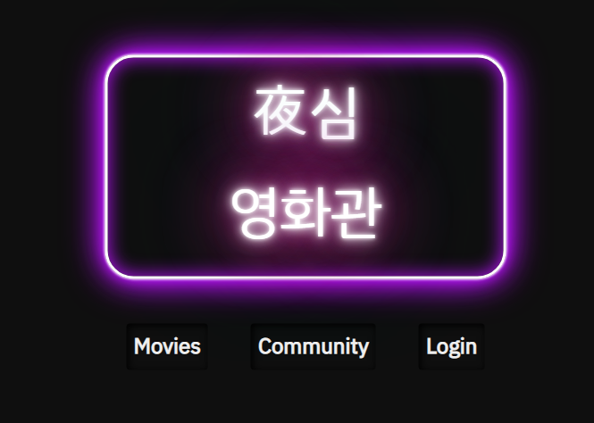

- index 페이지
  - 사용자가 방문 목적에 따라 곧바로 들어갈 수 있도록 버튼 구성


- 로그인 모달 창
- 최소한의 유효성 검사를 거친다.


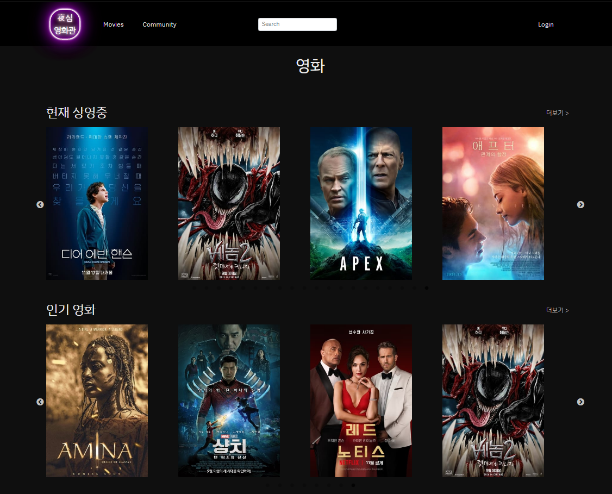

- 영화 전체 목록 페이지
  - 현재 상영 중 영화와 인기 영화 캐로셀을 동시에 보여줌
  - 캐로셀은 자동 전환


- `스파이더맨` 검색 시 출력되는 결과
  - 제목에 검색한 키워드가 있으면 모두 필터링


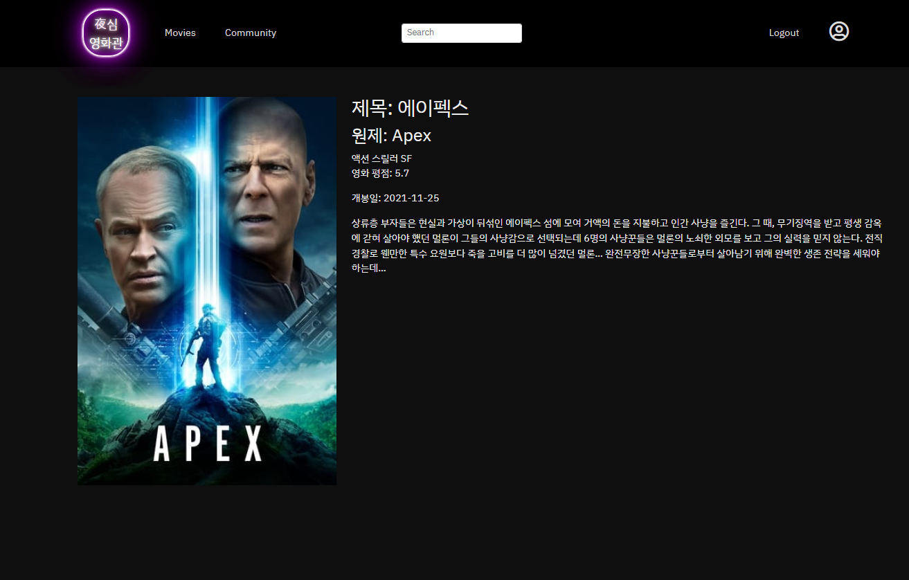

- 현재 상영 중 영화 상세 페이지
  - 간단하게 영화 포스터와 개봉일 등의 정보를 소개한다.


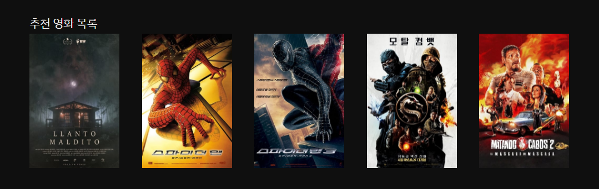

- 인기 영화 상세 페이지
  - 영화에 대한 상세 정보와 예고편, 리뷰 평점, 추천 영화 목록을 볼 수 있다.
  - 상세페이지에서 유저가 영화 `좋아요` 버튼을 누르면 이 영화를 좋아한 다른 유저들이 좋아요를 한 영화들을 count하여 가장 높은 좋아요 수 순서대로 추천 영화 목록에 나열한다.
  - 좋아요가 같은 것이 많으면 평점이 높은 영화 5선을 추천해준다.


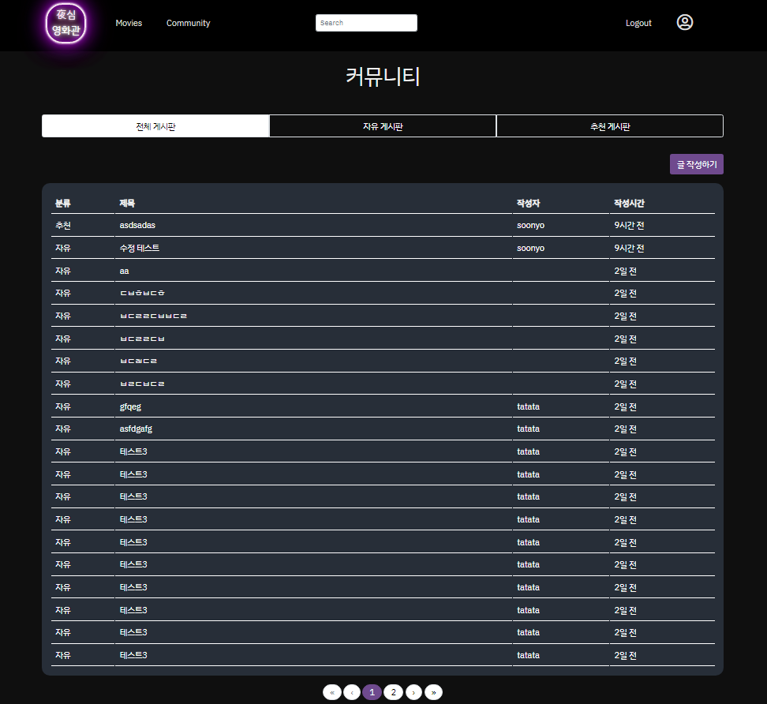

- community 전체 게시판
  - 탭으로 전체, 자유, 추천 게시판 선택 가능
  - 자유는 자유게시판 글만, 추천은 추천 게시판 글만 모여있음
  - 페이지 번호로 이동할 수 있음
  - 최신 글 작성 순으로 정렬


- 글 상세 페이지
  - 글에 대한 정보와 좋아요 버튼, 좋아요 수, 댓글 목록, 댓글 작성 양식이 있다.
  - 
  - 만약 로그인하지 않은 사용자라면 로그인 버튼이 생성된다.


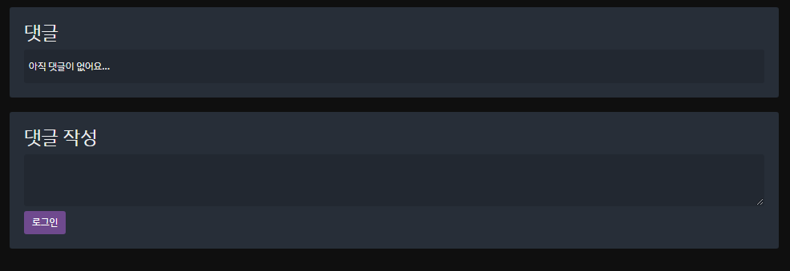

- 댓글을 조회하고 작성할 수 있음


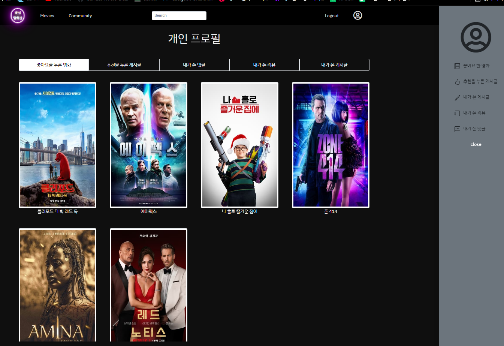

- 유저 프로필 페이지와 사이드바
  - navBar의 사람 로고를 누르면 사이드바가 나온다.
  - 개인 프로필 페이지에서 조회 가능한 목록
    - 좋아요를 누른 영화
    - 추천을 누른 게시글
    - 내가 쓴 댓글
    - 내가 쓴 리뷰
    - 내가 쓴 게시글


# 느낀점

- 이렇게 오랫동안 밤을 새면서 프로젝트 과제를 한 적이 거의 없었다. 이번 SSAFY 최종 관통 프로젝트 덕분에 새로운 경험을 하게 되었는데, 힘들지만 잘 돌아가는 사이트를 보면서 뿌듯한 마음도 든다. SSAFY가  '아, 이게 열정의 맛이구나.'라는 것을 일깨워주었다.
- 팀원분께 큰 도움이 못된 것 같아서 마음이 너무 아프다. 든든한 팀원이 되고 싶었는데 걸핏하면 버그를 내는 짐덩어리로 전락하고 말았다..(행복한 프로젝트는 벌써 물 건너감). 프론트 앤드라고 해서 만만하게 봤으나, 스타일링 하며 UX/UI, 사용하는 프레임워크에 대한 이해, 백앤드 API와의 통신과 상태 관리 등 신경쓸 것이 한 두가지가 아니었다. 그래서인지 백앤드를 맡은 팀원분께 이것저것 해달라는 게 많았다. 나중에 커피 쿠폰이라도 보내드려야겠다..

- 아직 버그도 많고 완성작이라기엔 부족함이 많지만, 그래도 이만하면 큰 의미가 있다고 생각한다. 앞으로 더 정진해서 막힘없이 개발을 할 수 있는 사람이 되어야겠다.

- 재만님 저와 함께 끝까지 프로젝트 해주셔서 감사합니다! 정말정말 고생많으셨습니다!!!!


## 더 배우면 좋을 것 같은 점

- 페이지네이션 구현

  => 정말 이번 프로젝트의 가장 큰 아쉬운 점이 페이지네이션을 구현할 줄 몰라서 프로젝트를 할 수 있는 범위가 크게 줄어든 것이었다. 부트스트랩 등에서 제공하는 페이지네이션도 있지만 스타일링을 내가 원하는 대로 자유롭게 줄 수 없다는 점이 큰 단점이었다. 팀원분이 많은 배려를 해준 덕분에 최대한 페이지네이션 없이 돌아가는 웹사이트를 만들었다.

- 프레임워크에 대한 이해

  => Vue도 그렇고 부트스트랩도 그렇고, 속성 적용을 위해 필요한 절차들이 있다는 걸 이번 프로젝트를 통해 알았다. 특히 Vue를 쉽게만 생각하고 프로젝트에 도전했다가 이번에 큰 대가를 치뤘다. 수업 내용에서만 언급한 것이 전부가 아니라는 점을 꼭 명심하자. 공부할 것들은 교재에만 있지 않다.

- 웹사이트 컴포넌트 구현

  => 프레임워크의 도움 없이 모달, navbar, sidebar처럼 웹사이트의 컴포넌트를 내가 자유 자재로 구현하고 스타일링 할 수 있는 수준의 html/css 지식이 필요하다는 걸 깨달았다. 프레임워크가 영 마음에 안들면 그냥 내가 만들어 버리면 되니까, 아는게 많을 수록 승자다.  특히 스타일링을 많이 해보고, 검색을 하면서 예제를 따라할수록 스타일에 대한 이해가 깊어지는 것 같았다.(position, 그리드 시스템 등)

  앞으로 작은 토이프로젝트 삼아서 컴포넌트 구현을 시간 날 때마다 해봐야겠다.

  미리 컴포넌트를 구현해놓으면 나중에 포트폴리오나 현업에서 구현할 일이 있을 때 나만의 프레임워크 샘플처럼 쓸 수 있을지도 모른다.


 
