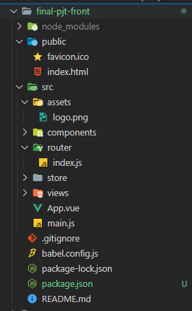
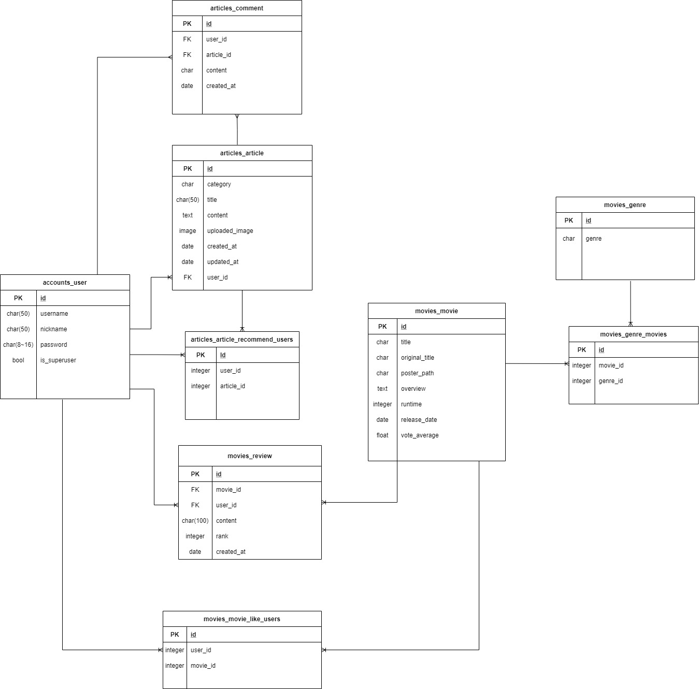

# final_proejct

> SSAFY 1학기 최종 관통 프로젝트

## 프로젝트 구조

**FRONT-END**

- Vue CLI 

- vuex, router

- Bootstrap-vue, Bootstrap, lodash, axios

  

**BACK-END**

- Django

- Django DRF

## 팀원 정보 및 업무 분담 내역

김순요: **front-end**

- 웹 UI 컴포넌트 구성
- 웹 UX 흐름 구성
- django API 서버와 통신
- 기본 스타일링
- 추천 알고리즘 구현

이재만: **back-end**

- django API 서버 구현
  - TMDB API 데이터 요청(현재 상영 영화 / 인기 영화)
  - DB 구축
- Client 서버와 통신
- 회원가입 기능 구현
- 로그인 기능 구현(토큰 발급)
- 추천 알고리즘 구현
- 기타 로직 구현(좋아요, 추천 등)

## 목표 서비스

> 영화 정보 검색 및 영화 추천 사이트

### **유저**

- [x] 회원가입
- [ ] 유저 프로필 조회
- [ ] 내가 좋아요를 누른 영화 목록 조회
- [ ] 내가 쓴 댓글 목록 조회
- [ ] 내가 쓴 게시글 목록 조회
- [ ] 추천을 누른 게시글 목록 조회
- [ ] 나에게 맞는 추천 영화 목록 조회
- [x] 로그인
- [x] 로그아웃

### **영화**

- [x] 전체 영화 목록 조회(현재 상영 중인 영화)
- [x] 영화 상세페이지 조회 + 한줄 평 조회, 작성
- [ ] 영화 좋아요, 좋아요 수
- [ ] 페이지네이션 구현

### **게시판**

- [x] 전체 게시판 게시글 목록 조회
- [x] 자유 게시판 게시글 목록 조회
- [x] 추천 게시판 게시글 목록 조회
- [x] 게시판 글 상세 조회 + 댓글 목록 조회, 작성
- [x] 페이지네이션 구현

### **관리자**

- [ ] 관리자 페이지 조회

### **(추가기능)**

**영화 목록**

- [ ] 반응형 웹 구현 
- [ ] 인피니티 스크룰(영화 목록 출력 시 페이지네이션 대체) 
- [ ] 장르 필터링 기능 구현 
- [ ] 상단 링크 클릭 시 트랜지션 애니메이션 적용 
- [ ] 영화 포스터 클릭 시 확대 및 flip 기능 구현(앞면 / 뒷면)

- [ ] 박스 오피스 API 요청 후 영화 목록 출력(최대 6개)

**영화 상세 페이지**

- [ ] 유튜브 영상 예고편  
- [ ] 줄거리 분석 + 워드 클라우드(상세정보 시각화) 
- [ ] 한 줄 리뷰 공감 버튼 구현

**로그인 페이지 & 회원 페이지**

- [ ] AuthO 구현(소셜 로그인)  
- [ ] 회원 정보 수정   
- [ ] 태그 구현  
- [ ] 웹페이지 검색 기능

## 데이터베이스 모델링(ERD)

